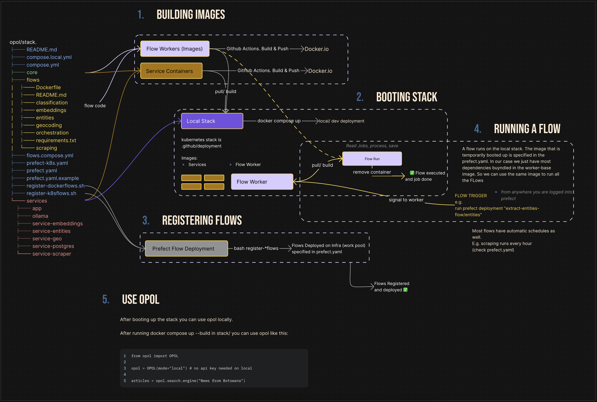
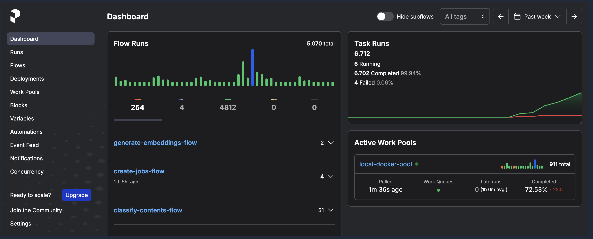

# Opol Stack

### Welcome to the Opol Stack documentation!

This guide provides an overview of the services, tasks, and flows used to orchestrate this data operation. Whether you're a developer looking to contribute or an enthusiast eager to understand the system, this documentation aims to help you navigate and comprehend the architecture effectively.

If something is unclear, missing documentation, or unnecessarily hard to get into, please let us know via a GitHub Issue! <3

> This documentation concentrates on the **stack**. If you want to learn more about the python client used to interact with the stack please visit [this page](../python-client/README.md) 

## Table of Contents
- [Overview](#overview)
- [Quick Start](#quick-start)
- [Directory Structure](#directory-structure)
- [Architecture](#architecture)
  - [Services](#services)
  - [Flows](#flows)
- [Detailed Setup](#detailed-setup)
- [Development Notes](#development-notes)
- [Resources](#resources)

## Overview

This `opol/opol/stack` directory is at the heart of the application, responsible for orchestrating various microservices and workflows essential for the system's functionality. It is ready to use with Docker Compose on your local machine.



## Quick Start

### 1. Clone the repository
```bash
git clone https://github.com/open-politics/opol.git
```
```bash
bash boot.sh
```

### 2. Run the boot script (in another shell)
Installs prefect via pip, sets the client url to the local prefect server, deploys the data pipelines and triggers a few them directly.
```bash
bash boot-prefect-flows.sh
```

### 3. Access & Use Opol
Once the stack is running:
- Dashboard `http://localhost:8089/dashboard`
- As Opol backend:
  ```python
  from opol import OPOL
  
  opol = OPOL(mode="local") # or "container"
  ```

*Note: Initial data population takes time. For every 10 sources specified, expect about 20 minutes to load everything into the system (on a 32GB RAM machine).*

## Directory Structure

| File/Directory          | Description                                                                 |
|-------------------------|-----------------------------------------------------------------------------|
| **README.md**           | This documentation                                                          |
| **.env.local**          | Local environment configuration                                             |
| **.store**              | Store for scraped data, geocoding data, and Redis queue storage             |
| **boot-local.sh**       | Script to quickly start the local stack                                     |
| **compose.local.yml**   | Compose file using a local Prefect server                                   |
| **compose.yml**         | Development Compose file                                                    |
| **core**                | Service package with shared models, URL mappings, database connections      |
| **flows**               | Batch processing flows: scraping, geocoding, entities, classification, etc. |
| **services**            | Services for live requests: scraping, geocoding, embeddings, dashboard      |
| **prefect.yaml**        | Prefect flow file for local Docker work pool                                |
| **prefect-k8s.yaml**    | Prefect flow file for Kubernetes work pool                                  |
| **register-flows.sh**   | Script to register flows to local Docker work pool                          |
| **register-k8sflows.sh**| Script to register flows to Kubernetes work pool                            |

## Architecture

Opol uses a dual architecture pattern to efficiently handle both batch processing and live usage:

### Services vs Flow & Task Orchestration




All data operations need two things with distinct operational requirements:
- **Batch Processing**: For regular data ingestion and enrichment
- **Live Usage**: For real-time API requests

This dual approach allows Opol to scale efficiently while remaining resource-conscious.

#### Building the Images used for prefect
Two ways to make prefect work with our docker images:

##### 1. Local setup
1.1 The compose file builds runner images that exit cleanly with exit code 0. These images are available in your "local registry" so the prefect.yaml chooses to search for locally built images when in the "job_variables" image_pull_policy: "Never" is set.
So your steps are:
- run `docker compsoe up --build -d` 
- execute `bash boot-prefect-flows.sh` (which adjusts the target url for prefect cli commands and deploys the flows to the local server with the local docker images)
##### 2. Prefect Cloud + Docker Hub Setup (our development setup)
- 2.1 Push docker containers to your registry. We have a convenience script to push the required containers: `bash push-registry-containers.sh`. Set `ORG_NAME=Your_Docker_Hub_Org_Name` and run `bash push-registry-containers.sh` (make sure you can push to Docker Hub from your terminal session).

- 2.2 Prefix the runner images job variables in `prefect.yaml` with your orgname so e.g. `image: runner-all-flows:latest` becomes `image: openpoliticsproject/runner-all-flows:latest`
- 2.3 Comment out the `database-prefect` and`engine-prefect-server` in the compose.yml
- 2.4 Set PREFECT_API_URL and PREFECT_API_KEY in your .env (not .env.local). This will automatically apply the the variables to your prefect.yaml deployments.
- 2.5 

### Services


**Databases & Queues:**
- PostgreSQL Database (`database-articles`)
- Redis Server (`engine-redis`)
- Prefect Server (`engine-prefect-server`)
+

**Services:**
- Opol Dashboard/Core App (`app-opol-core`)
- Scraping Service (`service-scraper`)
- Geocoding Service (`service-geo`)
- Embeddings Service (`service-embeddings`)
- Entities Service (`service-entities`)

**Engines:**
- Ollama Server (`engine-ollama`) - For local LLMs
- Pelias Placeholder (`engine-pelias-placeholder`) - For local geocoding
- SearXNG (`engine-searxng`) - Self-hostable search engine

### Flows

Flows handle batch processing using Prefect for workflow orchestration. This approach:
- Isolates different data operations in separate containers
- Schedules regular data ingestion and enrichment jobs
- Monitors health and performance
- Handles retries and failures gracefully
- Scales batch processing horizontally

#### Core Flow Sequence

The primary ingestion flow follows this sequence:

1. **Orchestration Flow** - Coordinates the entire pipeline
2. **Scraping** - Collects data from sources
3. **Embeddings** - Generates vector embeddings
4. **Entities** - Extracts named entities
5. **Geocoding** - Adds geographic information
6. **Classification** - Categorizes content

#### Flow Mechanics

The system uses two main mechanics:
1. **Orchestration Flow** triggers endpoints to:
   - Create jobs and push to Redis queues
   - Save results from processed queues

2. **Processing Flows** run on schedules or manual triggers to:
   - Check Redis for pending jobs
   - Process jobs and update queues

## Detailed Setup

### Environment Configuration

The `.env.local` file contains all necessary configuration and is pre-configured for local use. No additional configuration is required for basic functionality.


## Development Notes

### Working with Flows

To develop flows:
1. Set up a Prefect account or local server
2. Build and push required images
3. Start a Prefect work pool
4. Register flows with the `prefect.yaml` + `register-dockerflows.sh` script

Make sure the entrypoint paths in `prefect.yaml`:
- Match the path relative to the prefect yaml
- Match the path/ filestructure of the container that boots up

### Flow Execution

- Flows run in containers using Prefect's `serve` deployment
- The worker polls for jobs in the work pool
- When a job is received, the worker starts a container with the specified image

## Resources
- [Prefect Documentation](https://docs.prefect.io/)
- [Docker Documentation](https://docs.docker.com/)
- [SQLModel Documentation](https://sqlmodel.tiangolo.com/)
- [Open Politics Documentation](https://docs.open-politics.org/)

